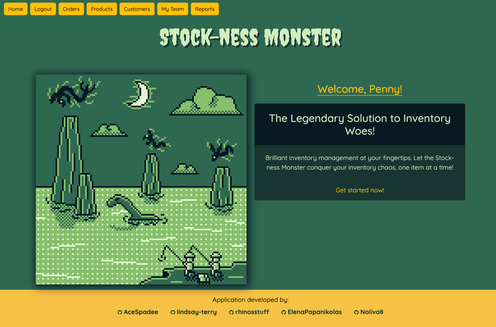
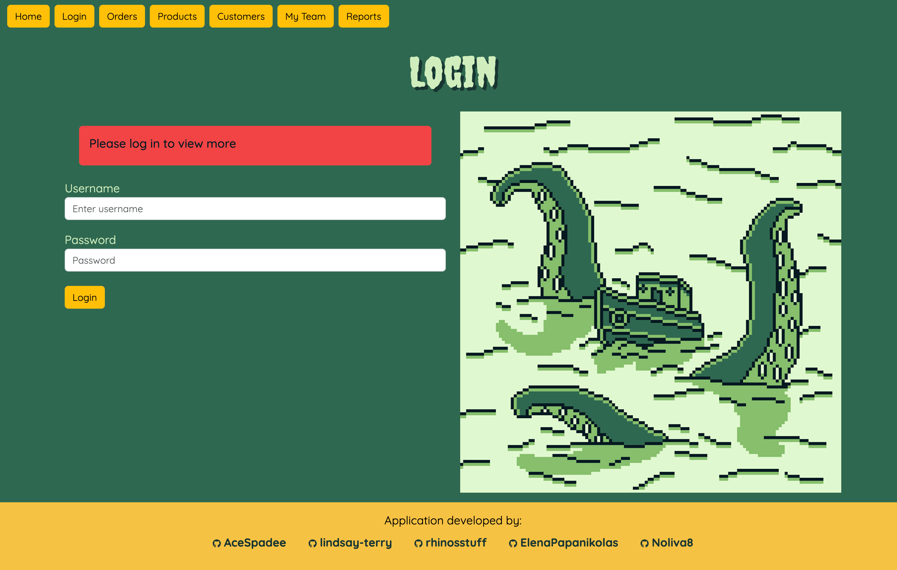
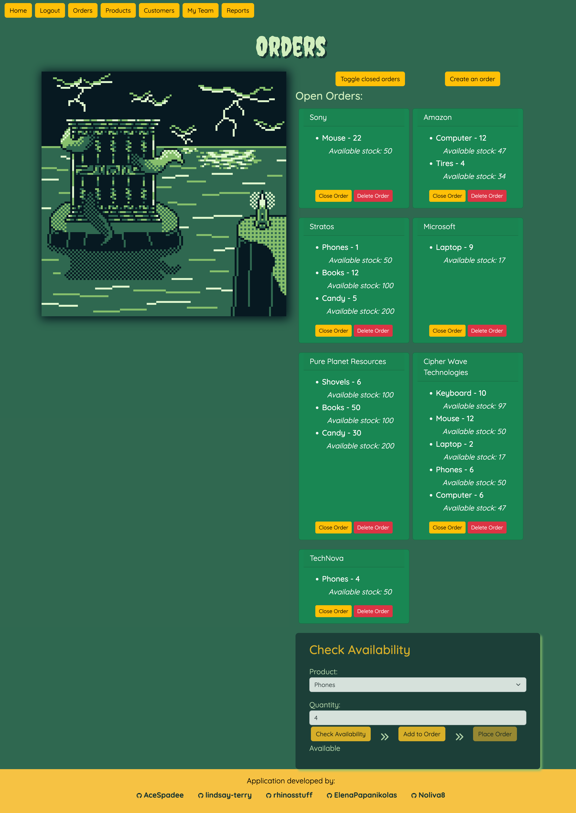
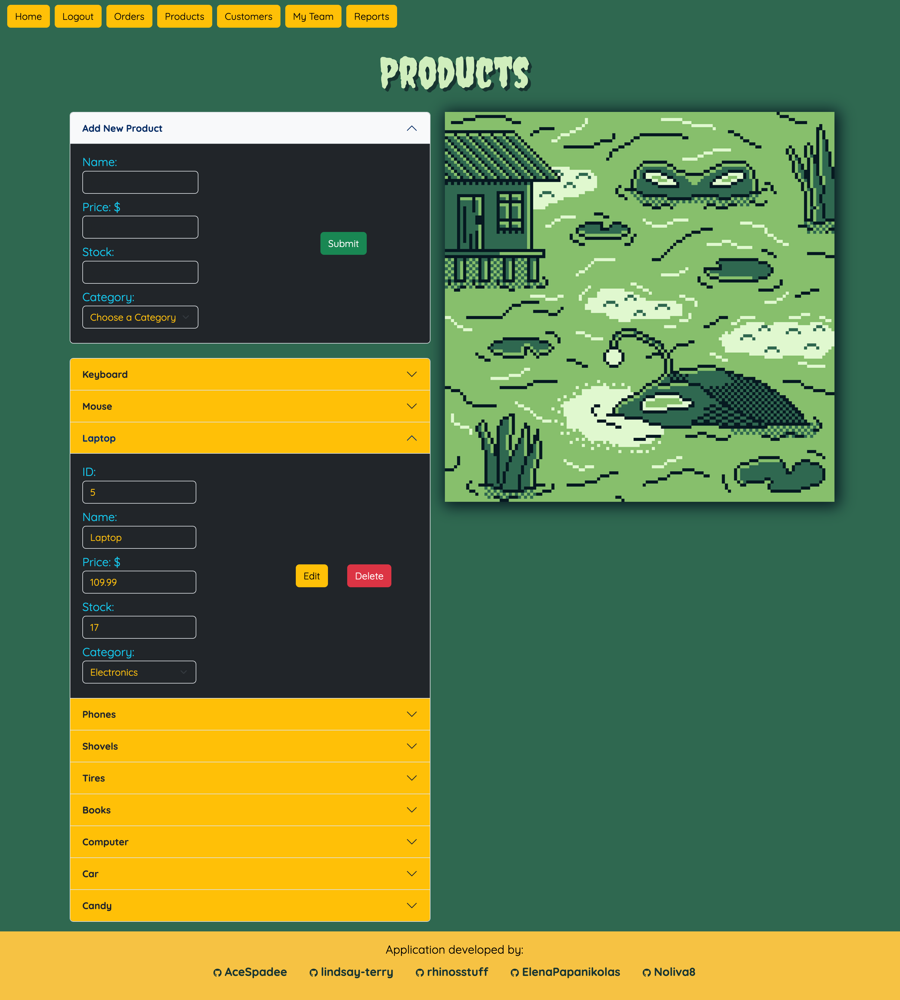
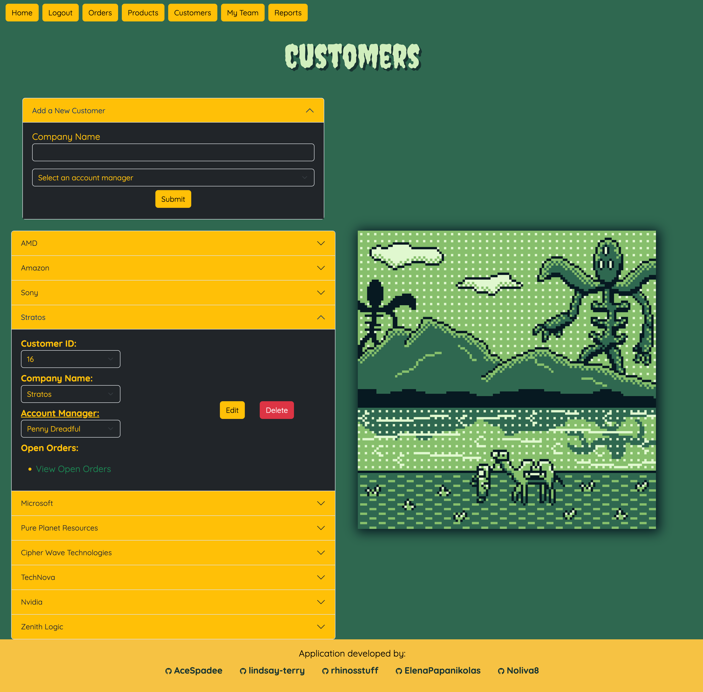
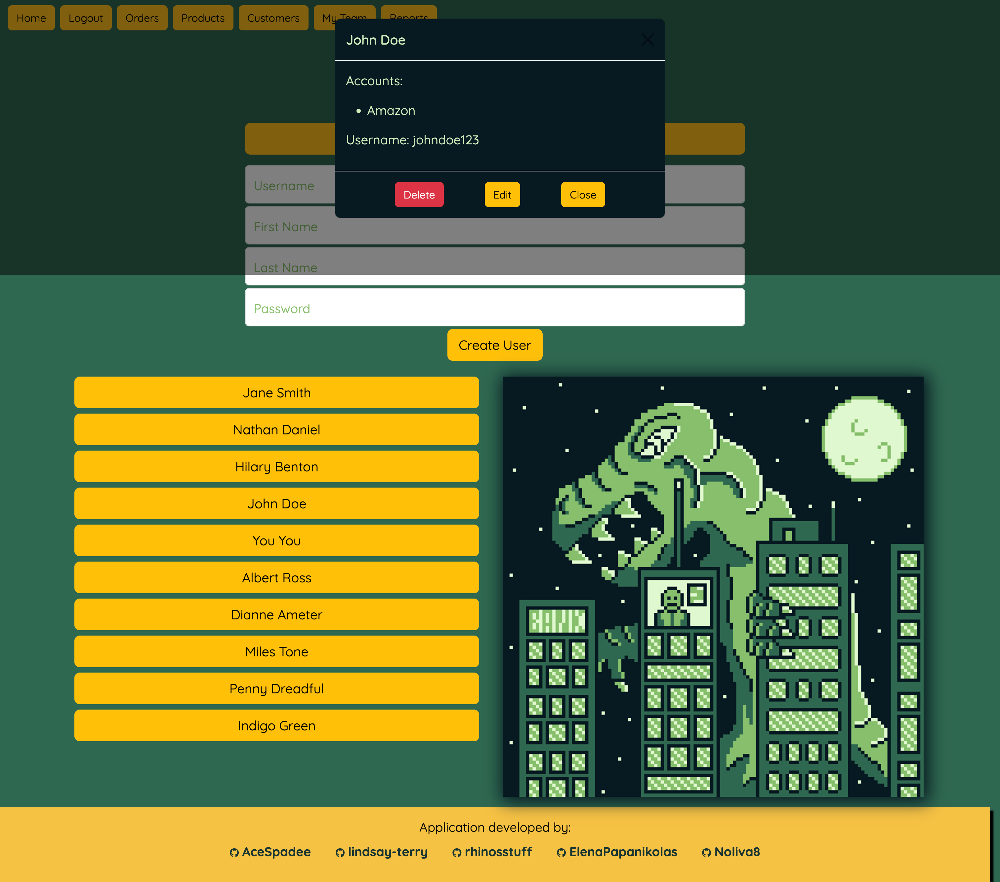
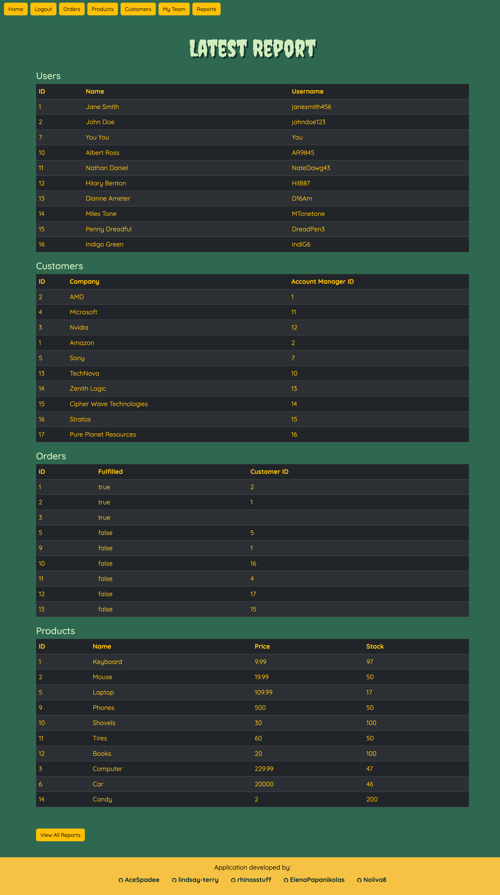

# Stock-ness Monster

## Description
Welcome to the Stock-ness Monster! Inventory so accurate you won't believe it exists! This is a robust internal company management application focused on conquering the chaos of order and inventory management, with team and client functionality. By using the Stock-ness Monster your company can seamlessly and efficiently keep track of its orders, products, customers, teams, and reports. 

## Table of Contents
* [Description](#description)
* [Installation](#installation)
* [Usage](#usage)
* [Contributing](#contributing)
* [Credits](#credits)
* [Technologies Used](#technologies-used)
* [Questions](#questions)
* [License](#license)

## Installation
There is no installation needed. As long as you have credentials to use the application, imply navigate to the deployed link and log in to start using the application.

## Usage
To use the Stock-ness Monster application simply navigate to the link below. This application uses authentication so the user must be logged in to view all pages. Once logged in simply navigate through the pages via the navigation menu at the top. On the Home page the user is presented with a simple landing page, welcoming them, via their entered first name. On the Orders page the user can view open and closed orders, create and place orders while checking the products availability, and delete orders without impacting the inventory. And lastly, close the order, which completes the loop and pulls stock from the inventory. On the Products page the user can view all products, edit and delete those products, and add a new product with a category. The application also features a Categories page to execute all the same functions regarding categories, as well as shows a list of products associated with each category. On the Customers page the user can view all the customers (aka the companies) they work with, and see the account manager associated with the customer, and the order data. The user can also add, edit and delete customers. On the My Team (Users) page, the user can view all the team members, aka the account managers, and see what accounts are associated to them. The user can also add, edit(anyone forget their password?), and delete team members. Lastly, on the Reports page, the user can view the latest report with all the current data from each page, and also view all reports with each report time stamped.

All the while, each page is receiving these changes in real time and reflecting accurate, up to date information.

### [**Deployed Application on Render]()

  
  
  
  
  
  
  

## Contributing 
For any contributions please contact us the via contact information located in the "Questions" section below.

## Credits
This application was made possible by:

Lindsay- Contributed to Orders page, parts of Customers page, parts of My Team (Users) page.

Ryan- Contributed to Products page and Categories page.

Peyton- Contributed to Reports page and part of My Team (Users) page.

Olivier- Contributed to the navbar, footer, and part of Orders page.

Elena- Contributed to Home page and parts of Customers page.

Every member of the team wrote back-end and front-end routes to make the functionality you enjoy possible. 

All images by <a href="https://pixabay.com/users/xelriz-14820749/?utm_source=link-attribution&utm_medium=referral&utm_campaign=image&utm_content=7473420">Fuadi</a> from <a href="https://pixabay.com//?utm_source=link-attribution&utm_medium=referral&utm_campaign=image&utm_content=7473420">Pixabay</a>

## Technologies Used
    - Node.js
    - Express.js
    - Handlebars.js
    - PostgreSQL
    - Sequelize
    - Sweetalert2 (pop-up alerts)
    - Express-Session
    - Bootstrap framework
    - Render for deployment
    - NPM packages for password hashing (bcrypt), function execution (cron), and date formatting (moment) (See package.json file for full list of dependencies)

## Questions 
Contact us with any questions regarding this project.

GitHub Profile: [Lindsay Terry](https://github.com/lindsay-terry) 

GitHub Profile: [Ryan Osguthorpe](https://github.com/rhinosstuff) 

GitHub Profile: [Peyton Iverson](https://github.com/AceSpadee) 

GitHub Profile: [Olivier Ndicunguye](https://github.com/Noliva8) 

GitHub Profile: [Elena Papanikolas](https://github.com/ElenaPapanikolas) 

## License 
This project is operating under the MIT license. For more detailed information about the license, please click [here](https://opensource.org/licenses/MIT).
